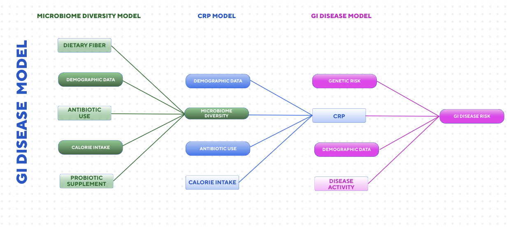

## Introduction

Throughout the environmental data science modeling class at the Bren School of Environmental Science & Management, UC Santa Barbara, we have learned the step-by-step process for developing, testing, and analyzing a model for environmental problem-solving. In this project, we will develop a clear, well-structured plan for using a model in a hypothetical environmental context.

## Modeling Question

Inflammatory bowel disease and irritable bowel syndrome affect millions of people worldwide, impacting quality of life and health outcomes. There is research indicating that a healthy gut microbiome can both reduce symptoms and perhaps reduce the risk of developing either disease. We are interested in the impact of probiotic Kefir supplements on the risk of inflammatory bowel disease and irritable bowel syndrome. Kefir increases the gut microbiome, which is thought to decrease disease risk. We will use a modeling framework to examine the relationship between a probiotic supplement and risk reduction by determining the optimal supplement intake to increase gastrointestinal tract microbiome activity and the amount of microbiome activity necessary for disease risk reduction.

## Conceptual Model

## Model Design

Our model consists of 3 submodels: one that predicts microbiome activity based on probiotic supplementation, one that uses that microbiome activity to generate a *C-reactive protein (CRP)* value, and another that uses the predicted CRP to calculate disease risk.

### ***Microbiome Activity:***

**Inputs**:

-   Dietary fiber

-   Demographic data (age, sex, etc)

-   Antiobiotic use

-   Calorie intake

-   Probiotic supplement

**Outputs**:

-   Microbe count

### ***C-reactive protein (CRP):***

Inputs:

-   Microbiome activity (previous model)

-   Demographic data (age, sex, etc)

-   Antibiotic use

-   Calorie intake

Outputs:

-   CRP

### ***Disease risk:***

**Inputs**:

-   Microbiome activity (from previous model)

-   CRP (from previous model)

-   Demographic data (age, sex, etc.)

-   Disease activity (if any)

**Outputs**:

-   Disease risk

All of these models will be combined into a wrapper to fully calculate disease risk based on the input for probiotic use. They are all forms of mathematical, deterministic, and static models.

This hypothetical model was inspired by the work of Ma et al.

To test model performance, we will first evaluate the model using a data set (source: Ananthakrishnan et al) comprising approximately 400 sample units with information on disease status and diet (fiber, protein, etc.) over 26 years. We can input this data set (diet, demographic data, calorie intake, antibiotic use) into our model without including probiotics as a metric, and our output of disease status can be interpolated into risk and should look appropriate.

## Analysis Plan

To answer our question about how disease risk is influenced by probiotic supplementation, we would implement our model with varying levels of probiotics and first see how disease risk responds. Do we expect CRP to increase exponentially and then level off, or perhaps follow a normal growth rate? We can vary all parameters at every level of probiotic supplementation using Sobol sensitivity testing to investigate how different demographics may respond differently to probiotic supplementation. We would vary parameters based on the literature and data used for validation testing. The sensitivity of each parameter can be visualized individually against disease risk, along with Sobol indices that assess each parameter's importance to disease risk. Sampled parameter sets can be visualized as a line graph with probiotic use on the x-axis and disease risk on the y-axis. Ideally, we will find an optimal probiotic supplementation that provides the best risk reduction.

## Assumptions

We are assuming that the gut microbiome, and ONLY the gut microbiome, is contributing to disease risk reduction. While we include other parameters in our model, ultimately, they all contribute to the gut microbiome, which we assume directly influences disease risk. While there are certainly other factors, they are not included in this model. We are also assuming CRP as a proxy for disease risk. We are not taking into account time factors, such as trends in probiotic use or fluctuations in health/age/disease activity over time, and rather assessing the cumulative impact of probiotics on disease risk. Finally, we are not including any medications taken by those with the disease that may significantly influence disease activity.

## Reference

Ma, W., Nguyen, L. H., Song, M., et al. (2021). Dietary Fiber Intake, the Gut Microbiome, and Chronic Systemic Inflammation in a Cohort of Adult Men. *Genome Medicine*, 13, 102. https://doi.org/10.1186/s13073-021-00921-y

Ananthakrishnan, A. N., Khalili, H., Konijeti, G. G., Higuchi, L. M., de Silva, P., Korzenik, J. R., Fuchs, C. S., Willett, W. C., Richter, J. M., & Chan, A. T. (2013). A Prospective Study of Long-Term Intake of Dietary Fiber and Risk of Crohn’s Disease and Ulcerative Colitis. *Gastroenterology*, 145(5), 970–977. https://doi.org/10.1053/j.gastro.2013.07.050
